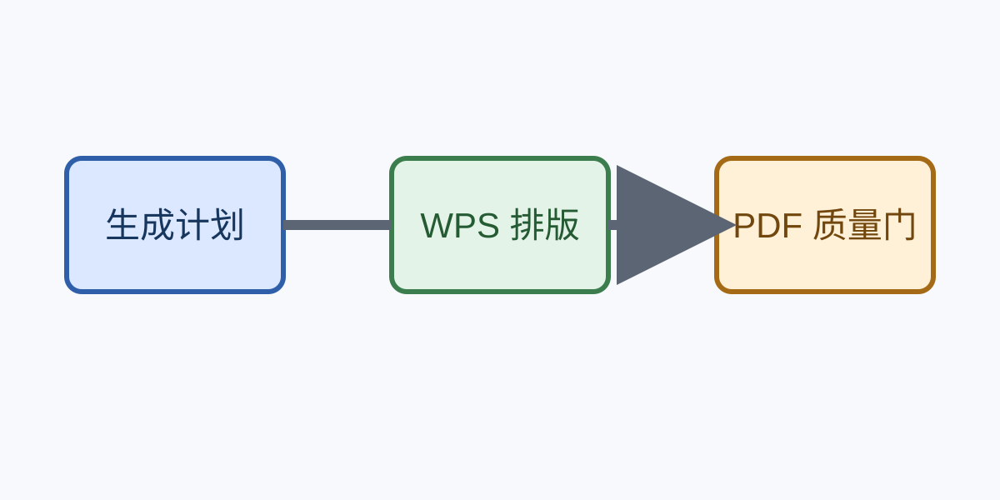

# 图形对象

:::figure {#fig:architecture caption="质量闭环架构" width="full" kind="diagram"}

:::

# 宽表对象

:::table {#tab:metrics orientation="landscape" caption="跨年度指标对比"}
| 指标 | 2024 | 2025 | 2026 | 2027 | 说明 |
|---|---:|---:|---:|---:|---|
| 文档页数 | 20 | 40 | 60 | 80 | 逐步扩大 |
| 生成耗时 | 45 s | 80 s | 120 s | 160 s | 保持预算内 |
| 质量规则 | 8 | 12 | 16 | 18 | 闭集扩展 |
| 自动重排 | 1 | 1 | 1 | 1 | 最多一次 |
:::

# 结论

图像不得越过正文边界，宽表应使用独立横向节。
